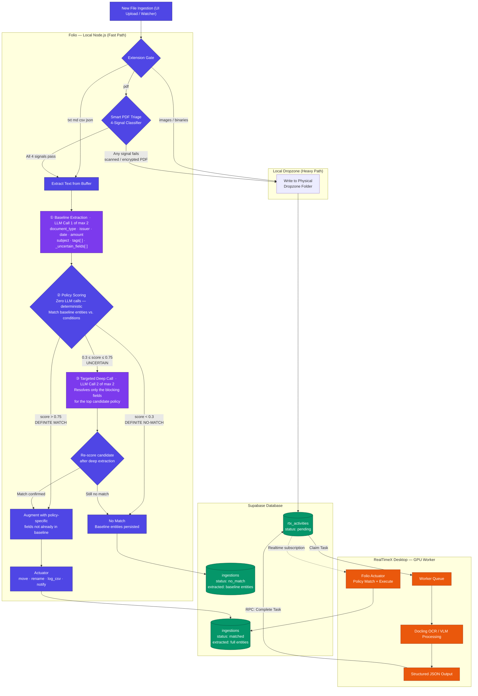

# Folio Hybrid Routing Architecture

This document describes Folio's document ingestion pipeline — from raw file upload through triage, AI extraction, policy matching, and final actuation. The architecture is designed around a single principle: **spend the minimum compute necessary to make a fully-informed decision.**

---

## Architecture Diagram



---

## Stage 0 — Triage

Before any AI work is done, the file is routed by two cheap, zero-LLM checks.

### Extension Gate

| Extension | Route |
|---|---|
| `.txt` `.md` `.csv` `.json` | Fast Path — text extracted directly from the upload buffer |
| `.pdf` | Passes to Smart PDF Triage |
| Everything else (images, `.docx`, binaries) | Heavy Path — written to the physical Dropzone |

### Smart PDF Triage — 4-Signal Classifier

A PDF hits the 4-signal classifier before any LLM is invoked. **All four signals must pass** for the document to take the Fast Path. A single failure routes to Heavy Path.

| Signal | Threshold | What it catches |
|---|---|---|
| **1. Normalized content length** | ≥ 100 chars after whitespace collapse | Truly empty or near-empty extractions |
| **2. Word count** (Unicode `\p{L}`) | ≥ 20 word-like tokens | Digit-only / symbol-only garbage; also handles non-Latin scripts without bias |
| **3. Garbage character ratio** | < 2% control chars + `U+FFFD` | Image bytes mis-decoded as text — the fingerprint of scanned or font-subset PDFs |
| **4. Page coverage** (multi-page only) | ≥ 40% of pages yield > 30 non-whitespace chars | Mixed scan+digital docs (e.g. a scanned contract with a text cover page) |

PDFs that fail triage (scanned images, encrypted, font-embedded) are written to the Dropzone and delegated to the RealTimeX GPU worker for full OCR.

---

## Stage 1 — Baseline Extraction (LLM Call 1 of max 2)

Once a document is on the Fast Path, **the first thing that always happens is a single LLM call** to extract a fixed baseline schema from the raw text. This runs unconditionally — before any policy is evaluated.

```ts
interface BaselineEntities {
  document_type: string;        // "invoice" | "contract" | "receipt" | "report" | ...
  issuer:        string | null; // who sent / issued the document
  recipient:     string | null; // who it is addressed to
  date:          string | null; // primary date (ISO 8601)
  amount:        number | null; // monetary value if present
  currency:      string | null; // "USD" | "EUR" | ...
  subject:       string;        // one-line description of the document
  tags:          string[];      // semantic labels: ["subscription", "renewal", "tax", ...]
  _uncertain_fields: string[];  // fields the model flagged as ambiguous or missing
}
```

The `tags[]` array is the most powerful field for policy matching — it lets the model assign semantic labels during extraction so that downstream matching can be deterministic rather than requiring additional LLM calls.

`_uncertain_fields` is the signal the engine uses in Stage 3 to decide whether a second call is justified.

---

## Stage 2 — Policy Scoring (Zero LLM calls)

After baseline extraction, each enabled user policy is scored deterministically against the extracted entities. **No LLM is invoked at this stage.**

Policy conditions are evaluated as follows:

| Condition type | Evaluation against baseline |
|---|---|
| `keyword` | Text scan on raw document text (unchanged) |
| `entity_equals` | Exact match on a baseline field (`document_type === "invoice"`) |
| `entity_contains` | Substring / array membership check (`tags.includes("renewal")`) |
| `llm_verify` | Cannot be resolved from baseline — treated as an open question, lowers the policy score |

Each policy receives a score `[0, 1]` based on how many of its conditions are satisfied and how many are unresolvable.

---

## Stage 3 — Confidence Decision

The highest-scoring candidate policy falls into one of three zones:

```
  DEFINITE NO        UNCERTAIN ZONE        DEFINITE YES
  score < 0.3        0.3 ≤ score ≤ 0.75    score > 0.75
       │                    │                    │
  No match.          Fire Targeted         Direct match.
  Save baseline.     Deep Call (Stage 3b)  Augment & execute.
```

### Stage 3b — Targeted Deep Call (LLM Call 2 of max 2, conditional)

The deep call only fires when **all three conditions hold**:

1. A candidate policy exists with score in the uncertain zone
2. Its score is higher than the current best confirmed match (if any)
3. The blocking fields are plausibly present in the document (no point asking for `invoice_number` if `document_type` came back as `"presentation"`)

The prompt for the deep call is surgically constructed from the candidate's open questions — not a repeat of baseline:

> *"We believe this may be a [Stripe Invoice] (confidence: 0.61). To confirm, extract only the following fields that remain unresolved: `subscription_plan`, `invoice_number`, `billing_period`. Return null for fields not present."*

After the deep call, the candidate policy is re-scored. It either confirms to a definite match or drops to a definite no-match. The LLM budget is exhausted after this call — no further inference occurs.

**LLM call budget per document: max 2.**

---

## Stage 4 — Actuation

Regardless of outcome, **baseline entities are always persisted** on the `ingestions` record. A document is never left with an empty `extracted` field.

| Outcome | `ingestions.status` | `ingestions.extracted` |
|---|---|---|
| Definite match (Stage 3) | `matched` | Baseline + policy-specific fields |
| Match after deep call (Stage 3b) | `matched` | Baseline + deep call fields |
| No match | `no_match` | Baseline entities only |

For matched documents, the **Actuator** executes the policy's declared actions: `move`, `rename`, `log_csv`, `notify`.

For Heavy Path documents processed by RealTimeX, the same Actuation stage runs after the GPU worker completes OCR and returns structured JSON via the `rtx_activities` RPC.

---

## Heavy Path — RealTimeX GPU Worker

Documents that fail triage (scanned PDFs, images, encrypted files) are written to the user's configured Dropzone folder and a `rtx_activities` record is inserted with `status: pending`. The RealTimeX Desktop app:

1. Polls for pending tasks via Supabase Realtime
2. Claims the task (`rtx_fn_claim_task`) with a machine ID lock
3. Reads the file from the physical `file_path` in the payload
4. Runs it through the Docling OCR / VLM pipeline
5. Calls `rtx_fn_complete_task` with the structured JSON result
6. Folio's Realtime subscription picks up the completion and routes it through the same Actuation stage as the Fast Path

Stale locks (tasks claimed but not completed within 5 minutes) are automatically released by a `pg_cron` job every minute.

---

## Design Principles

**Extract-first, match-second.** Baseline extraction runs before any policy is evaluated. This ensures matching operates on structured entities, not raw text, eliminating redundant LLM calls for questions the baseline already answers.

**Spend compute where decisions are uncertain.** The second LLM call is gated behind a confidence check. Definite matches and definite non-matches never need it. Only genuinely ambiguous documents pay for deeper inference.

**Entities are always the output.** Every document that touches the Fast Path emerges with structured baseline entities — whether it matches a policy or not. This supports future search, audit, and retrospective policy creation.

**GPU resources are reserved for what requires them.** The 4-signal PDF classifier prevents digital text documents from ever reaching the GPU worker. OCR is expensive; it only runs when the document is genuinely image-based.

**LLM budget is bounded and explicit.** Maximum 2 LLM calls per document. The pipeline never recurses or speculates beyond a single deep call.
