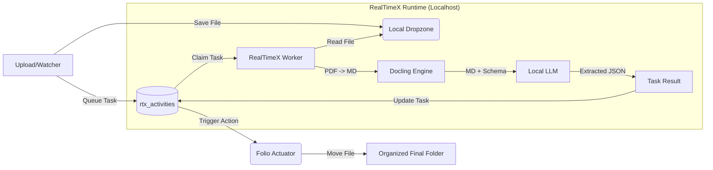

### 1. The Ingestion Architecture: "Local Microservices" Pattern

Think of `realtimex.ai` desktop app as your backend API, even though it's running on the same machine.

*   **Folio (The Client):** Watcher script + UI + Database connector.
*   **RealTimeX (The Server):** The GPU-accelerated runtime hosting Docling and the VLM

### 2. The Ingestion Workflow (Step-by-Step)

#### Step 0: The Dropzone
*   Folio does **not** store raw document bytes in the database.
*   Folio creates a physical "Dropzone" folder on the local machine (e.g., `~/.realtimex/folio/dropzone` or a configured `storage_path`).

#### Step 1: Ingestion (Folio)
*   Folio detects or receives `scan_001.pdf` via the UI or Watcher.
*   Folio saves the physical file into the **Dropzone**.
*   Folio generates a `task_id` and inserts a task into the `rtx_activities` table (Compatible Mode).
*   **Crucially**: The `raw_data` JSON only contains a metadata pointer to the physical file: `{ "file_path": "/Users/local/.realtimex/folio/dropzone/scan_001.pdf" }`.

#### Step 2: The Handshake (Folio $\rightarrow$ RealTimeX SDK)
Folio uses the RealTimeX SDK (via Compatible Mode `rtx_fn_claim_task`) to queue the work. The extraction schema (derived from the Policy) is also provided so the LLM output is strictly typed JSON.

#### Step 3: Execution (RealTimeX Runtime)
*   The standalone RealTimeX Desktop app picks up the `rtx_activities` task.
*   **Layer 1 (Docling):** RealTimeX reads the physical file from the Dropzone pointer and runs Docling to convert it into structured Markdown.
*   **Layer 2 (LLM Inference):** RealTimeX feeds that Markdown into the LLM with the JSON Schema.
*   **Return:** RealTimeX returns the unified extraction and updates `rtx_activities.result` (via `rtx_fn_complete_task`).

#### Step 4: Persistence & Actuation (Folio)
Folio detects the completed task.

*   `rtx_activities.result` contains the extracted JSON.
*   Folio matches the JSON data against the active Policy.
*   Folio executes the Policy Actions (e.g., moving the physical file out of the Dropzone into the final `Taxes/2026` folder).
    *   `entities` table (JSONB column): Stores the extracted data (`{ amount: 145.20 }`).
*   **Vector Embeddings:** If RealTimeX supports it, ask for embeddings of the Markdown during Step 3. Save these to Supabase `pgvector` for semantic search later ("Show me all bills from last winter").

### 3. Critical Considerations for this Setup

#### A. Asynchronous Queuing
Docling + LLM is **slow** (comparatively). It might take 5–15 seconds per page depending on the GPU.
*   **Do not block the Folio UI.**
*   Folio should display a "Processing..." state.
*   RealTimeX SDK likely supports streams or callbacks. Use them to show a progress bar.

#### B. Error Handling (The "Retry" Loop)
*   If RealTimeX returns `null` or a hallucination (e.g., date is "tomorrow"), Folio needs a UI for the user to fix it.
*   **The "Human-in-the-Loop":** The UI should show the PDF on the left and the extracted Form on the right. If confidence is low, highlight the field in Red.

### 4. Revised Architecture Diagram

